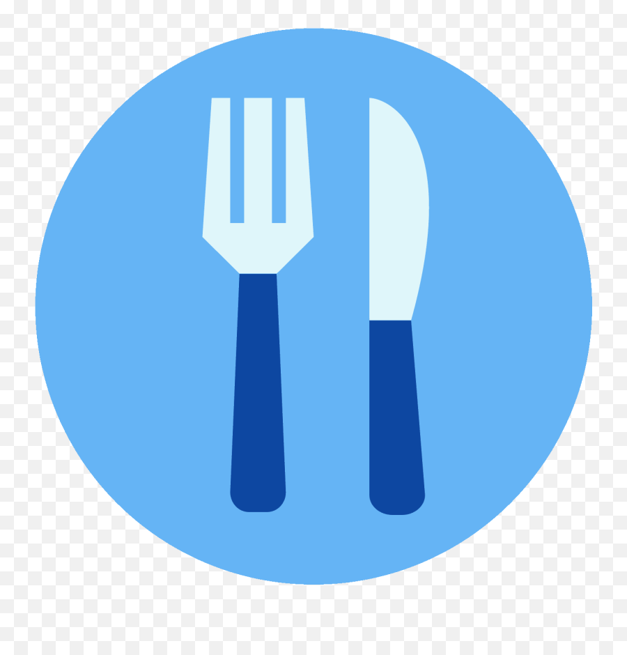

Meals
<a name="readme-top"></a>

<div align="center">
    
    <br/>
  <h3><b>Meals</b></h3>
</div>

<!-- TABLE OF CONTENTS -->

# 📗 Table of Contents

- [📖 About the Project](#about-project)
  - [🛠 Built With](#built-with)
    - [Tech Stack](#tech-stack)
    - [Key Features](#key-features)
  - [🚀 Live Demo](#live-demo)
- [💻 Getting Started](#getting-started)
  - [Setup](#setup)
  - [Prerequisites](#prerequisites)
  - [Install](#install)
  - [Usage](#usage)
  - [Run tests](#run-tests)
  - [Deployment](#deployment)
- [👥 Authors](#authors)
- [🔭 Future Features](#future-features)
- [🤝 Contributing](#contributing)
- [⭐️ Show your support](#support)
- [🙏 Acknowledgements](#acknowledgements)
- [📝 License](#license)

<!-- PROJECT DESCRIPTION -->

# 📖 Meals Project <a name="about-project"></a>

Coming Soon

<!-- **Meals website** displays scores submitted by different players. It also allows you to submit your score. All data is preserved thanks to the external [Meals API service](https://microverse.notion.site/Leaderboard-API-service-24c0c3c116974ac49488d4eb0267ade3).  -->

## 🛠 Built With <a name="built-with"></a>
- [x] HTML
- [x] CSS
- [x] ES6
- [x] Webpack
- [x] External

### Tech Stack <a name="tech-stack"></a>

<details>
  <summary>Client</summary>
  <ul>
    <li><a href="https://developer.mozilla.org/en-US/docs/Web/HTML">HTML</a></li>
    <li><a href="https://developer.mozilla.org/en-US/docs/Web/CSS">CSS</a></li>
    <li><a href="https://www.javascript.com/">ES6</a></li>
    <li><a href="https://webpack.js.org/">Webpack</a></li>
    <li><a href="https://www.themealdb.com/api.php">Meals DB API</a></li>
  </ul>
</details>
<!-- Features -->

### Key Features <a name="key-features"></a>

- **Preserves user input.**
<!-- - **Removing a selected item.**
- **Marking a selected item as complete.**
- **Removing all items marked as complete at once.**
- **Reordering a selected item (as drag-and-drop) [as an additional feature].** -->

<!--  -->
<p align="right">(<a href="#readme-top">back to top</a>)</p>

<!-- LIVE DEMO -->

## 🚀 Live Demo <a name="live-demo"></a>
- Coming Soon
<!-- - [Check out the live demo](https://rmiyoyo.github.io/Leaderboard/dist/) -->

<p align="right">(<a href="#readme-top">back to top</a>)</p>

<!-- GETTING STARTED -->

## 💻 Getting Started <a name="getting-started"></a>

To get a local copy up and running, follow these steps.

### Prerequisites

In order to run this project you need:

- A Chrome browser
- Node
- npm

### Setup

Clone this repository to your desired folder:


```sh
cd my-folder
git clone git@github.com:rmiyoyo/Spaceship-Kanbad-Board.git
```

### Install

Install the prerequisites this project using:

```sh
cd Spaceship-Kanbad-Board
npm init -y
npm install --save-dev hint@7.x
npm install --save-dev stylelint@13.x stylelint-scss@3.xstylelint-config-standard@21.x stylelint-csstree-validator@1.x
```

### Usage

To run project:

```bash
npm start
```
```bash
npm install
```

### Run tests

To run tests after setting up the linters, run the following command:

```sh
npx hint .
```
```sh
npx stylelint "**/*.{css,scss}"
```
```bash
npx eslint .
```

<!--
Example command:

```sh
  bin/rails test test/models/article_test.rb
```
--->

### Deployment

You can deploy this project using:

- Run index.html on your preferred browser.

<!--
Example:

```sh

```
 -->

<p align="right">(<a href="#readme-top">back to top</a>)</p>

<!-- AUTHORS -->

## 👥 Authors <a name="authors"></a>

👤 **Raphael Miyoyo**

- GitHub: [@rmiyoyo](https://github.com/rmiyoyo)
- Twitter: [@r_miyoyo](https://twitter.com/r_miyoyo)
- LinkedIn: [LinkedIn](https://linkedin.com/in/raphael-miyoyo)

## 👥 Authors <a name="authors"></a>

👤 **Sive Mdluli**

- GitHub: [@SiveMdluli](https://github.com/SiveMdluli)
- Twitter: [@SiveMdluli1](https://twitter.com/SiveMdluli1)
- LinkedIn: [LinkedIn](https://www.linkedin.com/in/sive-mdluli-4a7373239/)

<p align="right">(<a href="#readme-top">back to top</a>)</p>

<!-- FUTURE FEATURES -->

## 🔭 Future Features <a name="future-features"></a>

- [ ] **Deploy to a live server**

<p align="right">(<a href="#readme-top">back to top</a>)</p>

<!-- CONTRIBUTING -->

## 🤝 Contributing <a name="contributing"></a>

Contributions, issues, and feature requests are welcome!

Feel free to check the [issues page](../../issues/).

<p align="right">(<a href="#readme-top">back to top</a>)</p>

<!-- SUPPORT -->

## ⭐️ Show your support <a name="support"></a>

If you like this project, create a pull request or hit us up on [@r_miyoyo](https://twitter.com/r_miyoyo) and [@SiveMdluli1](https://twitter.com/SiveMdluli1)

<p align="right">(<a href="#readme-top">back to top</a>)</p>

<!-- ACKNOWLEDGEMENTS -->

## 🙏 Acknowledgments <a name="acknowledgements"></a>

- We appreciate you for having a look at our project! :100:

<p align="right">(<a href="#readme-top">back to top</a>)</p>

<!-- LICENSE -->

## 📝 License <a name="license"></a>

- This project is [MIT](./LICENSE) licensed. </br>

<p align="right">(<a href="#readme-top">back to top</a>)</p>
